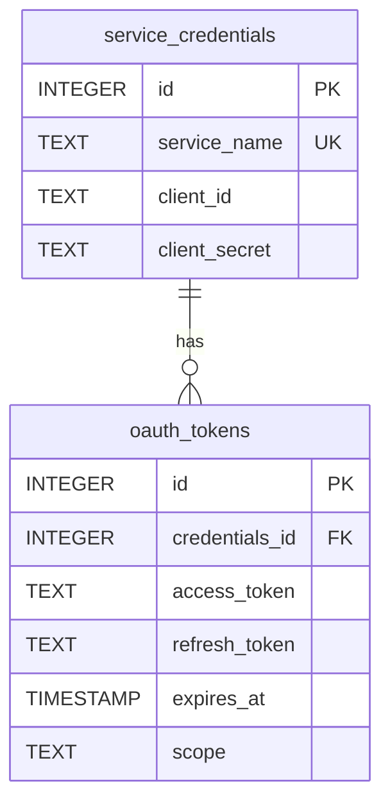

# データベーススキーマ

本アプリはローカル SQLite を使用します。マイグレーションで管理され、アプリ起動時に適用されます。

## テーブル定義

### service_credentials

| 列名         | 型      | 制約/備考                 |
|--------------|---------|---------------------------|
| id           | INTEGER | PRIMARY KEY               |
| service_name | TEXT    | NOT NULL, UNIQUE          |
| client_id    | TEXT    | NOT NULL                  |
| client_secret| TEXT    | NOT NULL                  |

### oauth_tokens

| 列名            | 型        | 制約/備考                                                                 |
|-----------------|-----------|---------------------------------------------------------------------------|
| id              | INTEGER   | PRIMARY KEY                                                               |
| credentials_id  | INTEGER   | NOT NULL, FK→service_credentials.id, ON DELETE CASCADE, UNIQUE(1:1関係)   |
| access_token    | TEXT      | NOT NULL                                                                  |
| refresh_token   | TEXT      | NOT NULL                                                                  |
| expires_at      | TIMESTAMP | NOT NULL（例: YYYY-MM-DD HH:MM:SS）                                       |
| scope           | TEXT      | NULL（スペース区切り複数）                                                |

制約:

- UNIQUE(credentials_id) により「1 Credentials 1 Token」を保証

## インデックス

- idx_oauth_tokens_credentials_id (UNIQUE)

注記: 上記ユニークインデックスはマイグレーションで作成されます（ファイル名は日付スタンプ付き）。既存環境では適用漏れがないか確認してください。

## マイグレーション方針

- 新規列はデフォルトを持たせつつ非破壊で追加
- 破壊的変更はマイグレーションでバックアップ/データ移行手順を明記
- バージョンはタイムスタンプで管理し、上位互換性を重視
