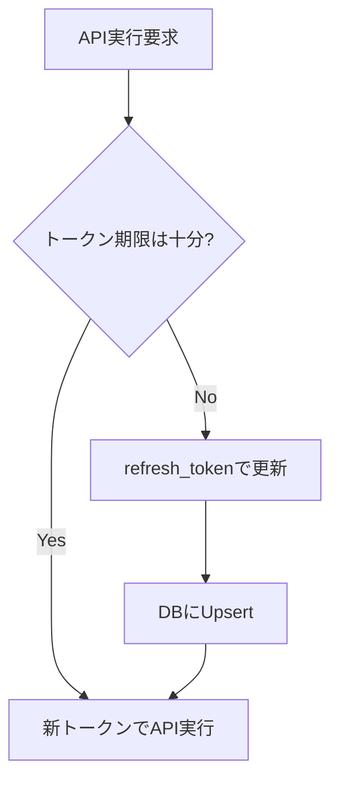

# OAuth 認証フロー詳細

## 目的

- Google/YouTube の OAuth2 認証でアクセストークン/リフレッシュトークンを取得し、ローカルDBに保存する。

## コンポーネント

- `start_oauth_flow` (Tauri command): 認証URL生成、ローカルサーバ起動、URL返却、state検証
- `oauth_server` (Rust): `http://localhost:1421/oauth/callback` で code/state を受領
- `OAuthService` (Rust): state発行（生成のみ）、トークン交換、永続化
- `TokenRepository` (Rust): `upsert_token` で1 credentials 1 token を保証

## コントラクト

- 入力: `credential_id: i64`
- 出力: `auth_url: String`
- コールバック: `/oauth/callback?code=...&state=...`
- エラー: 例外はログに記録し、UIには文字列化メッセージ

## セキュリティ

- CSRF対策: `state` を `authorize_url` 発行時に生成し、コールバックで一致確認
- トークン秘匿: アクセストークン/リフレッシュトークンはログ出力しない
- スコープ: `youtube` + `userinfo.profile` + `userinfo.email`

## API呼び出し時のトークン確認/リフレッシュ

- API実行前に `ensure_valid_access_token(credential_id, skew)` を呼び出す
- 期限切れ、または `skew` 秒以内に失効予定の場合は `refresh_token` により更新しDBへUpsert

## 画面遷移

1. UI: ボタン押下でコマンド呼び出し → 返ってきたURLを外部ブラウザで開く
2. ブラウザ: Googleで認可 → ローカル `http://localhost:1421/oauth/callback` にリダイレクト
3. サーバ: code/state 受領 → oneshot でアプリへ通知
4. アプリ: state検証（Command）→ トークン交換（Service）→ DB保存
5. ブラウザ: 完了ページ（日本語、5秒後自動クローズ）

関連仕様:

- `doc/specs/src-tauri_src_db_commands.start_oauth_flow.md`
- `doc/specs/src-tauri_src_services_oauth_service.md`
- `doc/specs/src-tauri_src_oauth_server.md`

