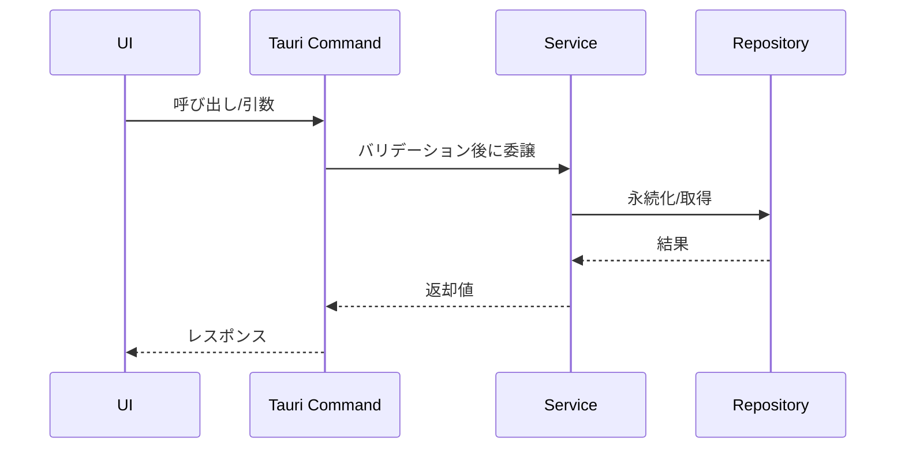

# 機能仕様書テンプレート（1対1）

対象実装: `src-tauri/src/<path>.rs` / `src/<path>.tsx` など
````markdown
# 機能仕様書テンプレート（1対1）

対象実装: `src-tauri/src/<path>.rs` / `src/<path>.tsx` など

## 概要
- 目的:
- 背景/前提:

## ユースケース
- アクター:
- 事前条件:
- 基本フロー:
- 代替フロー/例外:

## URL（フロントエンドの場合）
- 例: `/credentials`, `/credentials/add`

## I/O 契約
- 入力:
- 出力:
- エラー:

## 設計方針
- 層の責務:
- 依存関係:
- セキュリティ:

## テスト項目
- 正常系:
- 例外系/境界条件:



````
  - アクター:
