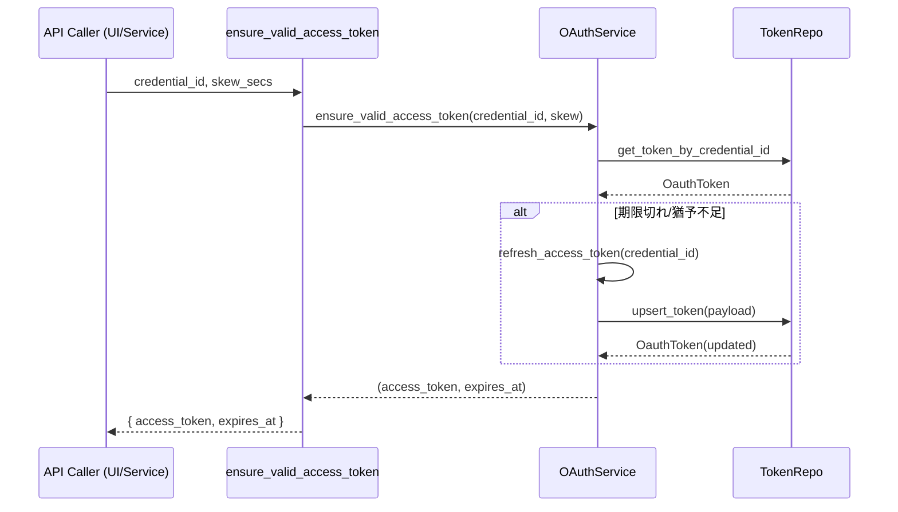

# 仕様書: Tauri コマンド `ensure_valid_access_token`（新規）

対象実装: `src-tauri/src/db/commands.rs` に追加予定の `ensure_valid_access_token`

## 概要

- 目的: API実行前にアクセストークンの有効期限を確認し、期限切れ/猶予不足ならリフレッシュしてから、使用可能なアクセストークンを返す。
- 背景/前提: トークンは `oauth_tokens` に1:1保存。`OAuthService.ensure_valid_access_token` を委譲呼び出し。

## I/O 契約

- 入力: `credential_id: i64`, `skew_secs: i64`（失効までの猶予秒。例: 120）
- 出力: `Ok({ access_token: String, expires_at: String })`
- エラー: `Err(String)`

補足: `expires_at` はUTCの `YYYY-MM-DD HH:MM:SS` フォーマット。

## 設計方針

- 層の責務: Command は引数検証と Service 呼び出しのみ。ビジネスロジックは Service に集約。
- 依存関係: `oauth_service.ensure_valid_access_token`
- セキュリティ: アクセストークン値はログに出さない。エラーメッセージは簡潔に。

## URL（フロントエンドの場合）

- 呼び出し元: API実行の共通前処理（フック/ユーティリティ）で事前に呼ぶ想定

## テスト項目

- 正常系: 有効期限十分→現行トークン返却／猶予不足→リフレッシュ後の新トークン返却
- 異常系: トークン未登録／refresh_token欠如／リフレッシュ失敗（invalid_grant等）

 
