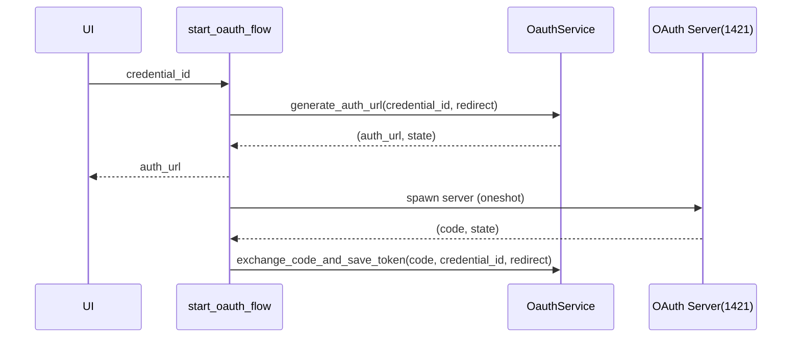

# 仕様書: Tauri コマンド `start_oauth_flow`

対象実装: `src-tauri/src/db/commands.rs` の `start_oauth_flow`

## 概要

- 目的: 指定された資格情報IDのクライアント設定を用いてOAuth認可URLを生成し、ローカルの一時HTTPサーバ（単一接続・固定ポート1421）を起動してコールバックを受け取り、トークンを保存する。
- 背景/前提: Google OAuth（YouTube含むフルスコープ）。CSRF対策としてstateを発行・検証。

## I/O 契約

- 入力: `credential_id: i64`
- 出力: `Ok(String)` 認可URL（外部ブラウザで開く用）
- エラー: `Err(String)`（原因メッセージ）

## 設計方針

- 層の責務: CommandはI/O整形とタスク起動。ロジックはOAuthServiceに委譲。
- 依存関係: `oauth_service.generate_auth_url`, `oauth_service.exchange_code_and_save_token`, `oauth_server::start_oauth_server`
- セキュリティ: CSRF state検証、トークンはログに出さない、固定ポート1421、単一接続。

## URL（フロント連携）

- トリガーUI: `src/pages/CredentialsListPage.tsx` の「Authenticate」ボタン

## テスト項目

- 正常系: 有効なcredentialでURLが返る。コールバックでstate一致→トークン保存。
- 異常系: credential不存在/無効→エラー。state不一致→保存しない。サーバ起動失敗→ログ出力。

