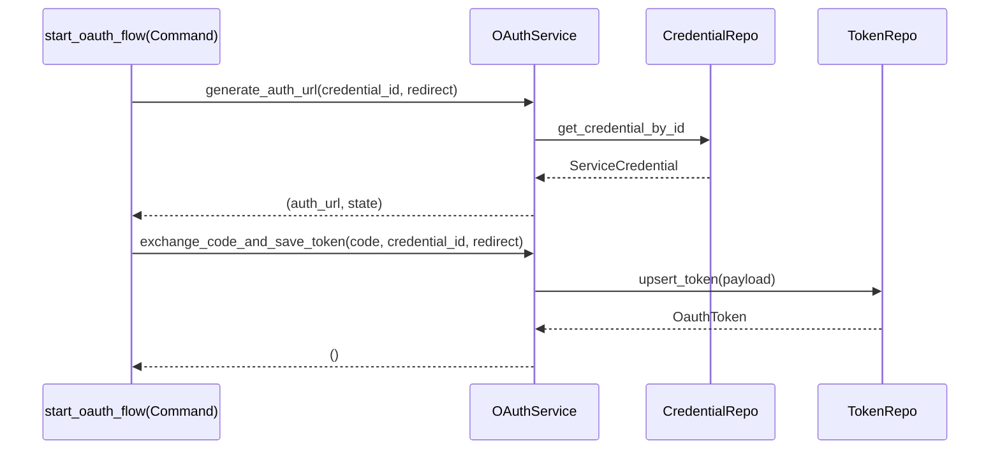
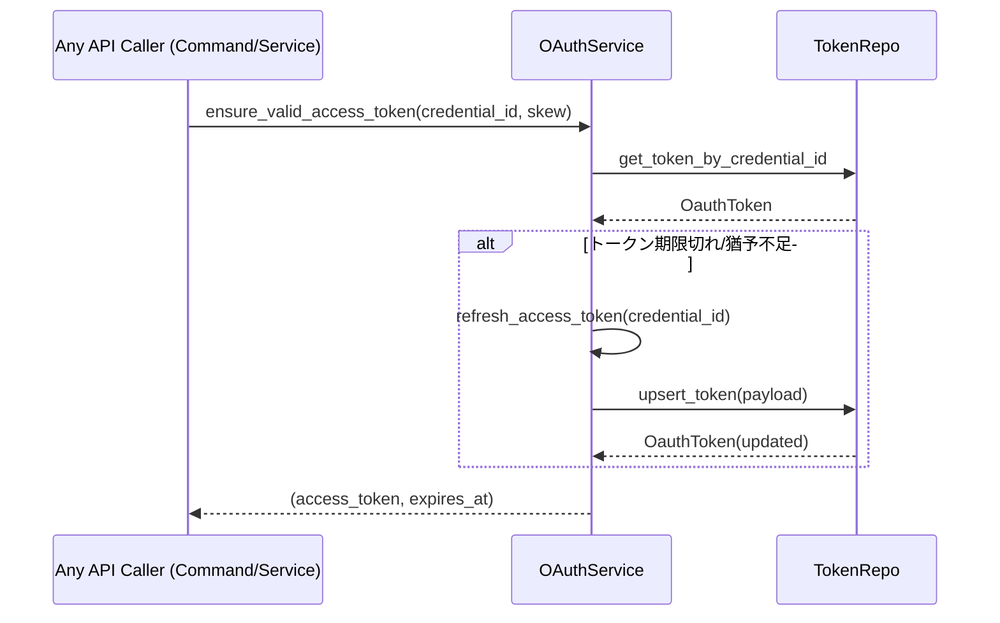

# 仕様書: Service `OAuthService`

対象実装: `src-tauri/src/services/oauth_service.rs`

## 概要

- 目的: OAuth2の認可URL生成とコード交換（トークン保存）を担当。
- 前提: Google OAuth（AuthUrl/TokenUrl固定）。スコープは以下を付与。
  - `https://www.googleapis.com/auth/youtube`
  - `https://www.googleapis.com/auth/userinfo.profile`
  - `https://www.googleapis.com/auth/userinfo.email`

## I/O 契約

- `new(credential_repo, token_repo) -> Self`
  - 入力: `Arc<dyn CredentialRepository>`, `Arc<dyn TokenRepository>`
  - 出力: `OAuthService`

- `generate_auth_url(credential_id: i64, redirect_url: &str) -> anyhow::Result<(String, String)>`
  - 入力: 資格情報ID、リダイレクトURL（例: `http://localhost:1421/oauth/callback`）
  - 出力: `(authorize_url, csrf_state)`
  - エラー: 資格情報未存在/OAuthクライアント作成失敗 等

- `exchange_code_and_save_token(code: String, credential_id: i64, redirect_url: &str) -> anyhow::Result<()>`
  - 入力: 認可コード、資格情報ID、リダイレクトURL
  - 出力: `()`（DBへUpsert済み）
  - エラー: トークン交換失敗/保存失敗 等

### 新規追加 API（トークン有効性確認・リフレッシュ）

- `ensure_valid_access_token(credential_id: i64, skew_secs: u64) -> anyhow::Result<(String, String)>`
  - 目的: 現在のアクセストークンの有効期限を確認し、期限切れ/猶予不足（`skew_secs`以内）ならリフレッシュする
  - 入力: 資格情報ID、猶予秒（例: 120）
  - 出力: `(access_token, expires_at)`（文字列）
  - エラー: トークン未登録/リフレッシュトークン欠如/リフレッシュ失敗/DB保存失敗

- 内部: `refresh_access_token(credential_id: i64) -> anyhow::Result<(String, String)>`
  - 目的: DBの`refresh_token`で新しい`access_token`/`expires_at`を取得し保存
  - 入力: 資格情報ID
  - 出力: `(access_token, expires_at)`
  - エラー: `invalid_grant` 等のリフレッシュ失敗、ネットワークエラー

## 設計方針

- 層の責務: 認可URL生成/コード交換/Upsertを担い、UI/HTTP/I/O詳細は持たない。
- 依存関係: `CredentialRepository`, `TokenRepository`, `oauth2` crate
- セキュリティ:
  - CSRF stateの検証は呼び出し元（Command）で実施。Serviceはstateを返すのみ
  - アクセス/リフレッシュトークンはログ出力しない
  - `oauth_tokens.credentials_id`はユニーク。保存はUpsert
  - リフレッシュ時もトークン値はログ出力禁止。失敗理由のみ簡潔に記録

## テスト項目

- 正常系: 有効な`credential_id`で認可URL/Stateが返る。コード交換成功でUpsertされる
- 例外系: `credential_id`不正/クライアント作成失敗/交換失敗/DB保存失敗

### リフレッシュ関連

- 正常系: 期限切れ/猶予不足時に自動リフレッシュし、新しい`access_token`/`expires_at`が返る
- 例外系: `refresh_token`欠如、`invalid_grant`、ネットワークタイムアウト

