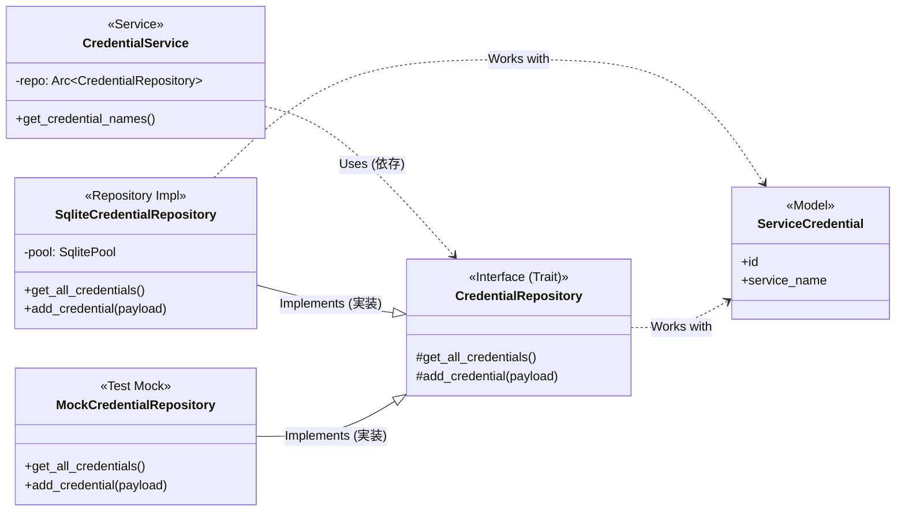

# アプリケーションアーキテクチャ解説

このドキュメントは、本アプリケーションのバックエンドにおける各コンポーネントの役割と、それらがどのように連携するか（特に依存性の注入 - DI）を解説します。

## 登場人物の役割

アプリケーションは、主に以下の4つの要素で構成されています。

### 1. モデル (`db/models.rs`)

- **役割:** 純粋なデータ構造です。
- **概要:** データベースのテーブルの各行を表現します。例えば `ServiceCredential` 構造体は `service_credentials` テーブルの一行に対応します。ロジックは持たず、データの入れ物としてのみ機能します。

### 2. リポジトリ・トレイト (`db/repositories.rs`)

- **役割:** データベース操作の「規約（インターフェース）」を定義します。
- **概要:** `CredentialRepository` がこれにあたります。ここでは「何ができるか」（例: `get_all_credentials`, `add_credential`）だけを定義します。「どうやって実現するか」は一切記述しません。サービス層など、他のコンポーネントはこのトレイトにのみ依存します。

### 3. リポジトリ実装 (`db/repositories.rs`)

- **役割:** 「規約」を具体的に実装するクラスです。
- **概要:** `SqliteCredentialRepository` がこれにあたります。リポジトリ・トレイトを実装し、具体的なSQLクエリを実行してデータベースと実際にやり取りします。本番環境ではこちらが使われます。

### 4. サービス (`services/credential_service.rs`)

- **役割:** ビジネスロジックを担当します。
- **概要:** アプリケーション固有のルールや計算など、主要なロジックをここに記述します。サービスは、データベースの具体的な実装（`SqliteCredentialRepository`）を知りません。抽象的なリポジトリ・トレイトにのみ依存し、それを通してデータ操作を依頼します。

## 全てを繋ぐ仕組み：依存性の注入（DI）

DIは、あるコンポーネントが必要とする別のコンポーネント（依存性）を、自分自身で生成するのではなく、外部から与えてもらう（注入してもらう）という設計手法です。これにより、コンポーネント間の結合度が下がり、交換やテストが容易になります。

### 関係図 (Mermaid)

### 動作フロー

- **本番環境では:**
  1. アプリ起動時に `setup.rs` が **`SqliteCredentialRepository`** のインスタンスを生成します。
  2. それを `AppState` に詰めて、TauriのDIコンテナに登録します。
  3. コマンドやサービスは、DIコンテナから `AppState` を受け取り、`CredentialRepository` トレイトのメソッドを呼び出します。
  4. 実行時には、実際に `SqliteCredentialRepository` のメソッドが動作します。

- **テスト環境では:**
  1. テストコードの中で **`MockCredentialRepository`** のインスタンスを生成します。
  2. テスト対象のサービス（例: `CredentialService`）に、引数として手動で `MockCredentialRepository` を注入（`new`関数で渡す）します。
  3. サービスは、本番と同じように `CredentialRepository` トレイトのメソッドを呼び出しますが、実行されるのは `MockCredentialRepository` のダミーのメソッドです。

このように、依存性を外部から注入可能にすることで、同じサービスコードを、本番では本物のDBで、テストでは偽物のDBで動かすことが可能になっています。
